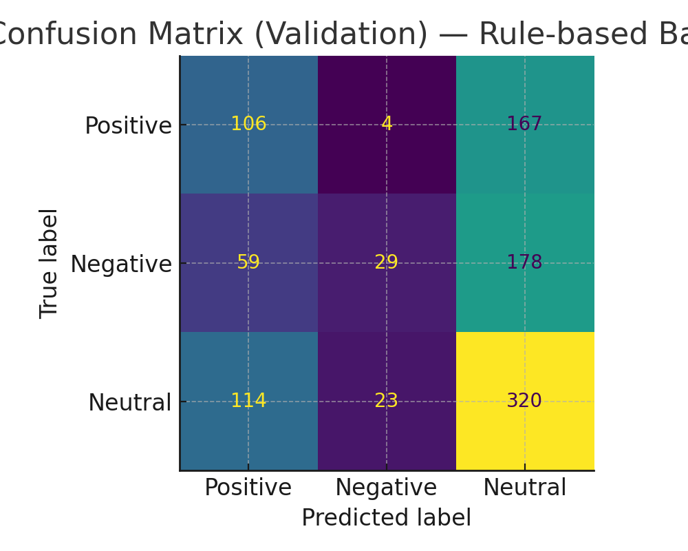

# Twitter Sentiment Analysis

## What It Does
A Natural Language Processing project that performs **entity-level sentiment analysis** on multilingual tweets.  
There were two Kaggle datasets, only for training, and one for validation. The instructions were to predict whether a tweet expresses a **positive**, **negative**, or **neutral** sentiment toward a given entity. 

Dataset: [Twitter Entity Sentiment Analysis (Kaggle)](https://www.kaggle.com/datasets/jp797498e/twitter-entity-sentiment-analysis/data)

## Background
This was my first major project working with a Kaggle set. Normalizing and cleaning data, then using NLP techniques to analyze it. Social medias like Twitter have massive volumes of unstructured text data. I wanted to see how easily it was possible to parse and sort tweets based on its sentiment. And after finding this dataset on Kaggle, I took the challenge upon myself to get a high accuracy. I was able to achieve a 97% match with the validation dataset.

There were a lot of challenges with cleaning this dataset. For example, it contained tweets in many languages and some contained links or emojis. The method I went through with in the end was to first convert all text to lowercase. Then I removed links by checking if it had "https", aswell as wiped mentions (@) and hastages (#). I was then able to categorize tweets based on the categories above, and deleted null or empty tweets. Overall, I learned a lot through this process and it definetely yileded interesting results.


---

## Tech Stack
- Python
- pandas, numpy (data handling)
- scikit-learn (TF-IDF + Logistic Regression)
- NLTK (text cleaning)
- matplotlib, seaborn (visualization)
- pytest (testing)

---

## Dataset Graphs:
Class Distribution:


Confusion Matrix:


---

## How to Run

1. **Clone the repo**
   ```bash
   git clone https://github.com/<raymondc-dev>/twitter-sentiment-analysis.git
   cd twitter-sentiment-analysis
Install dependencies

```bash
Copy code
pip install -r requirements.txt
Run scripts

```bash
Copy code
python src/clean_data.py
python src/train_model.py
python src/evaluate_model.py
python src/visualize_results.py
Run tests

```bash
Copy code
pytest

